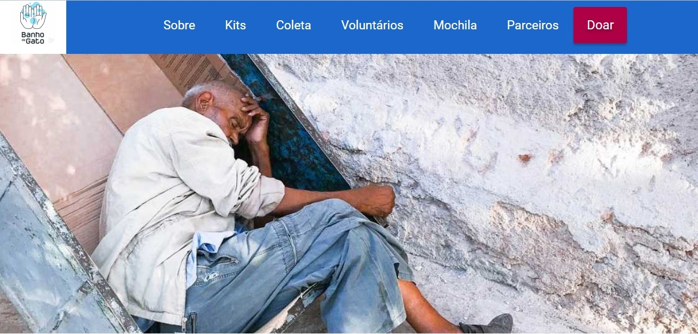
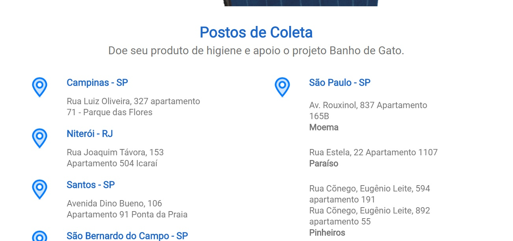
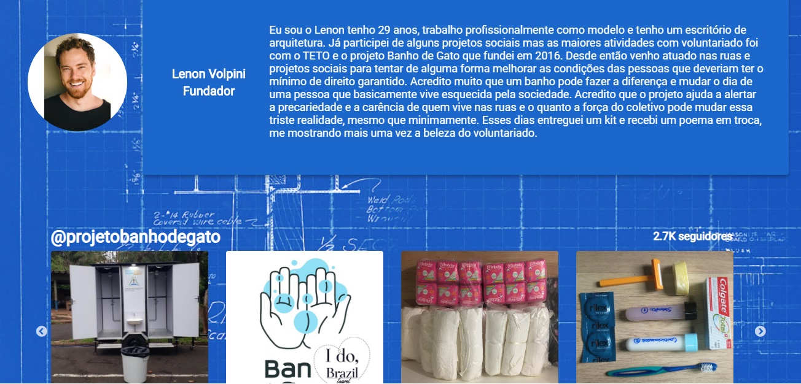
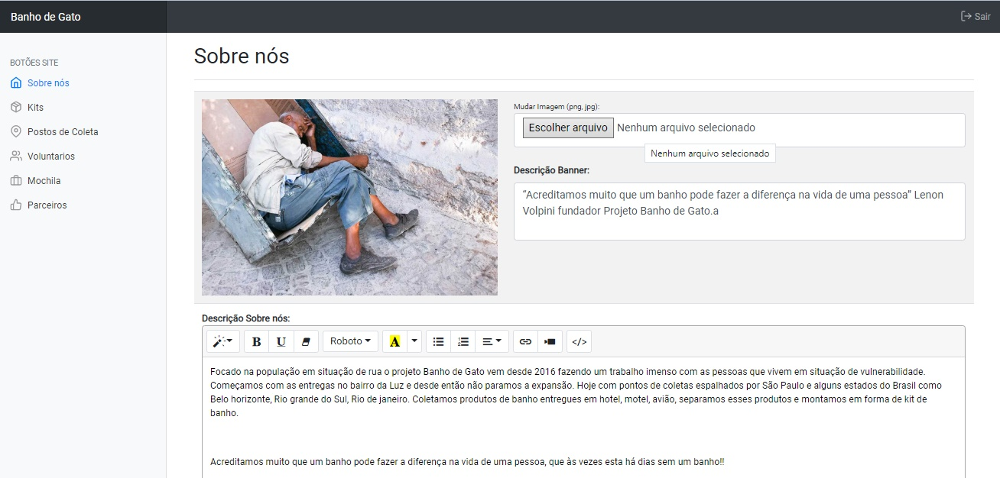

# Banho de Gato - [Gama Academy]
> Site realizado de forma volunta para transformação digital da ONG Banho de Gato

### Sobre a ONG
Focado na população em situação de rua o projeto Banho de Gato vem desde 2016 fazendo um trabalho imenso com as pessoas que vivem em situação de vulnerabilidade. Começamos com as entregas no bairro da Luz e desde então não paramos a expansão. Hoje com pontos de coletas espalhados por São Paulo e alguns estados do Brasil como Belo horizonte, Rio grande do Sul, Rio de janeiro. Coletamos produtos de banho entregues em hotel, motel, avião, separamos esses produtos e montamos em forma de kit de banho.

Com a ideia de fazer um site onde a ONG pudesse atualizar ele sem ter custos com profissionais, foi desenvolvido um simples painel para atualização do conteudo da landpage, onde ele consegue atualizar imagens e textos referentes da pagina, tudo feito em PHP e MySQL

## Histórico de lançamentos

* 0.0.1
    * Info: Repositorio criado
    * New: Criado o primeiro wireframe
    * New: Criado as primeiras imagens e disposição dos itens na pagina
* 0.0.4
    * Update: Atualizaçao do wireframe para layout final
    * Update: Finalização de layout final e cores
    * Update: Testes de responsividade e imagens
    * Update: Correção de problemas no iOS e Android
    * Update: Correção de feedback do teste de usabilidade
    * Update: Correção final dos problemas de responsividade
    * Info: Primeiro envio para o servidor banhodegato.ong.br
* 0.1.1 
    * Update: Ultimos testes em tablet e dispositivos moveis
    * Info: Site aprovado e no ar
* 0.1.4
    * New: Pagina de Login para o painel
    * New: Integração do dashboard bootstrap com o projeto
    * New: Criação do banco de dados
    * Update: Atualização do dashboard com as funcionalidades em PHP
    * Update: Finalização de painel dashboard e primeiros teste
    * Update: Mudando conteudo da landpage de estatico para dinamico e integrando com banco de dados

## Envolvidos no desenvolvimento

Jorge Henrique – [@LinkedIn](https://www.linkedin.com/in/jorge-henrique-baptista/) – jorgehenrique@live.com

The MIT License (MIT)

Copyright (c) 2020 banhodegato
